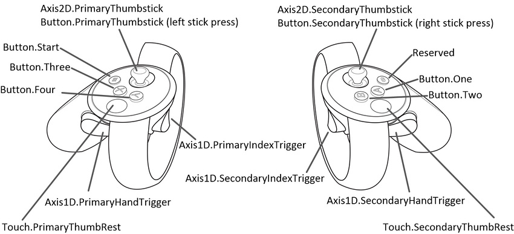

# XR Components

## Features

-   XRControllerVibratation
-   XRInput
-   XRNodeController
-   Editor Scripts
    -   InputManagerSetup

## Installation

### Unity Package Manager _(Unity 2018.3)_

<https://docs.unity3d.com/Packages/com.unity.package-manager-ui@2.0/manual/index.html>

```json
{
    "dependencies": {
        "com.candycoded.xr-components": "https://github.com/CandyCoded/XR-Components.git#upm"
    }
}
```

## Documentation

### XRControllerVibration

### XRInput



Reference: <https://docs.unity3d.com/Manual/OculusControllers.html>

#### Button

| Name                |
| ------------------- |
| One                 |
| Two                 |
| Three               |
| Four                |
| Start               |
| PrimaryThumbstick   |
| SecondaryThumbstick |

#### Axis1D

| Name                  |
| --------------------- |
| PrimaryIndexTrigger   |
| SecondaryIndexTrigger |
| PrimaryHandTrigger    |
| SecondaryHandTrigger  |

#### Axis2D

| Name                          |
| ----------------------------- |
| PrimaryThumbstickHorizontal   |
| PrimaryThumbstickVertical     |
| SecondaryThumbstickHorizontal |
| SecondaryThumbstickVertical   |

#### Get

```csharp
if (XRInput.Get(XRInput.Button.One)) {

    Debug.Log("Button One is being held");

}
```

#### GetDown

```csharp
if (XRInput.GetDown(XRInput.Button.One)) {

    Debug.Log("Button One was pressed");

}
```

#### GetUp

```csharp
if (XRInput.GetUp(XRInput.Button.One)) {

    Debug.Log("Button One was released");

}
```

### XRNodeController
